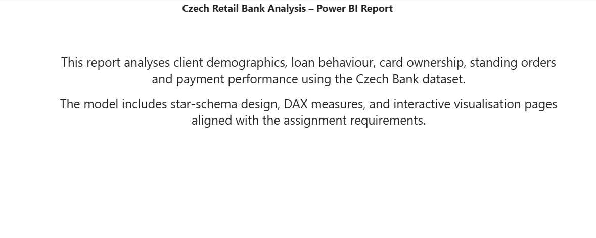
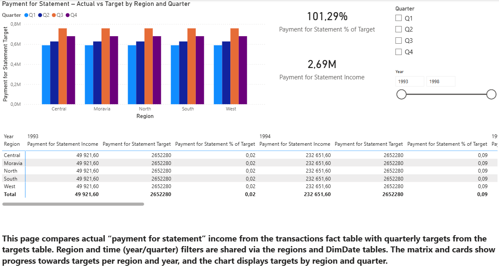
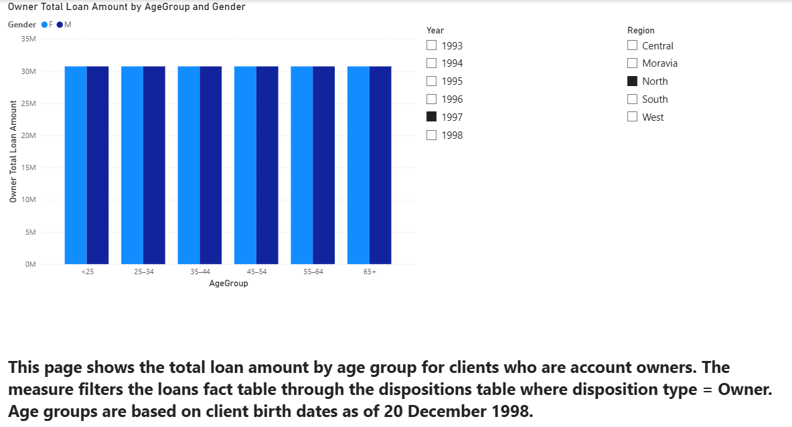
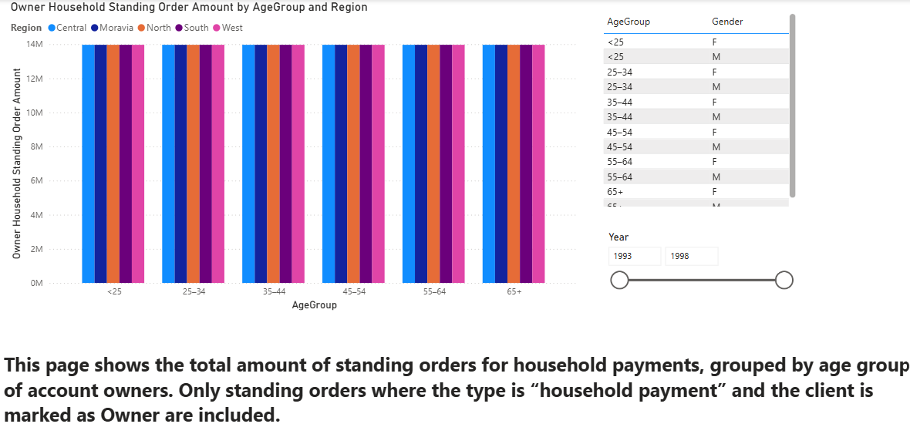
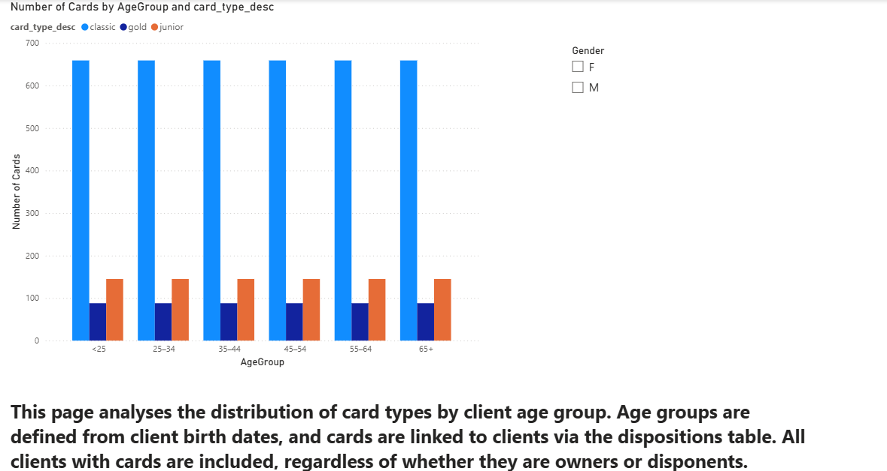
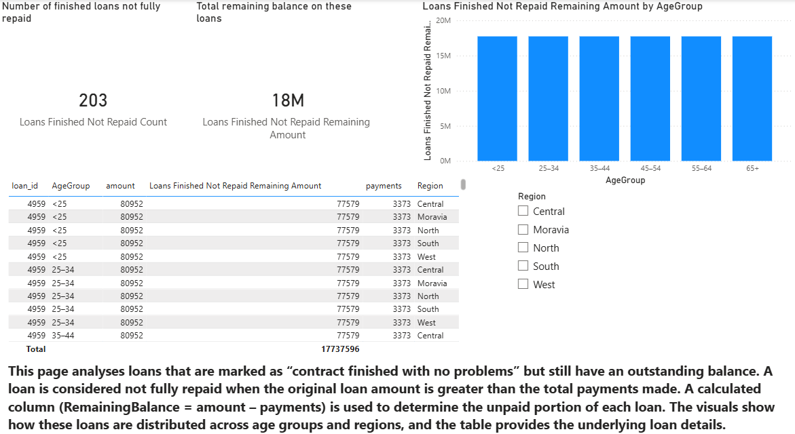

# czech-retail-bank-analysis
An interactive Power BI analytics report designed to evaluate client demographics, loan performance, payment targets, and standing order behavior using the Czech Retail Banking dataset.
# Czech Retail Bank Analysis — Power BI Report

> **Note:** The full interactive `.pbix` file is hosted on Google Drive due to GitHub browser upload limits. Click the badge above to download and inspect the data model.
## Key Features & Insights

* **Target vs. Actual Performance:** Tracks "Payment for Statement" income against quarterly targets across regions (Central, Moravia, North, South, West) and time periods.
* **Demographic Segmentation:** Analyzes client loan behavior and standing order distributions broken down by age groups and card ownership types.
* **Dynamic Filtering:** Implements shared cross-filtering via `DimDate` and `Region` dimension tables for seamless interactive exploration.
* **Data Modeling:** Designed using a clean **Star-Schema** layout with custom DAX measures for KPI tracking (e.g., % of Target achieved, Total Income).

## Report Architecture

* **Cover Page:** Executive summary and project context.

* **Payment for Statement Targets:** Bar charts, KPI cards, and matrix visuals analyzing regional performance against financial goals.

* **Loans by Age Group (Owners):** In-depth demographic evaluation of bank loan distributions.

* **Standing Orders by Age Group:** Analysis of client recurring payments and engagement.

* **Card Types by Age Group:** Ownership breakdown across card tiers (e.g., Classic, Junior, Gold) by age group.

* **Finished Loans Not Repaid:** Risk assessment page identifying defaulted or unpaid completed loan contracts.

## Tech Stack & Skills

* **Tool:** Microsoft Power BI Desktop
* **Data Modeling:** Star-Schema Design, Relational Data Mapping
* **Calculations:** DAX (Data Analysis Expressions)
* **Visualization:** Custom KPI Cards, Clustered Column Charts, Interactive Matrices, Slicers

## How to View

1. **Download Report:** Download the `.pbix` file from this repository.
2. **Open in Power BI:** Launch [Power BI Desktop](https://powerbi.microsoft.com/) and open the downloaded file to interact with dynamic filters and visual slicers.
